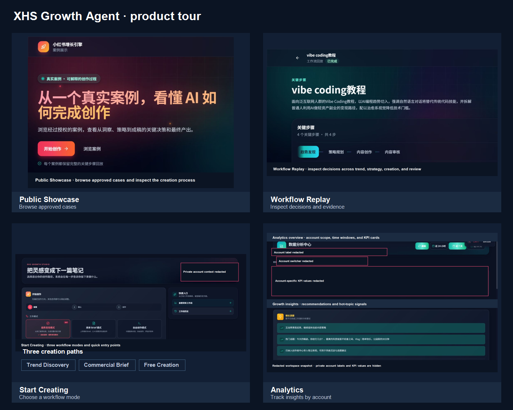
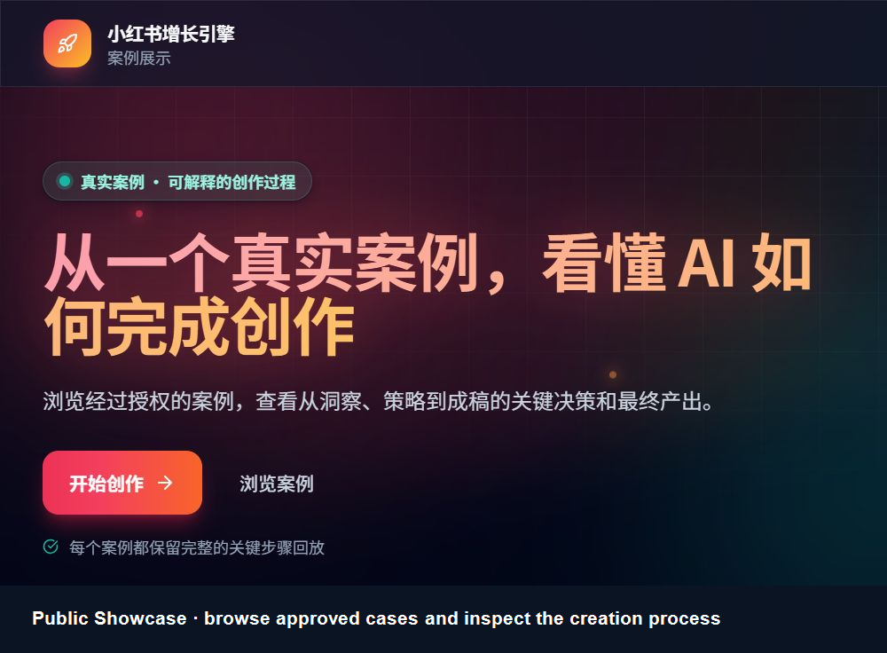
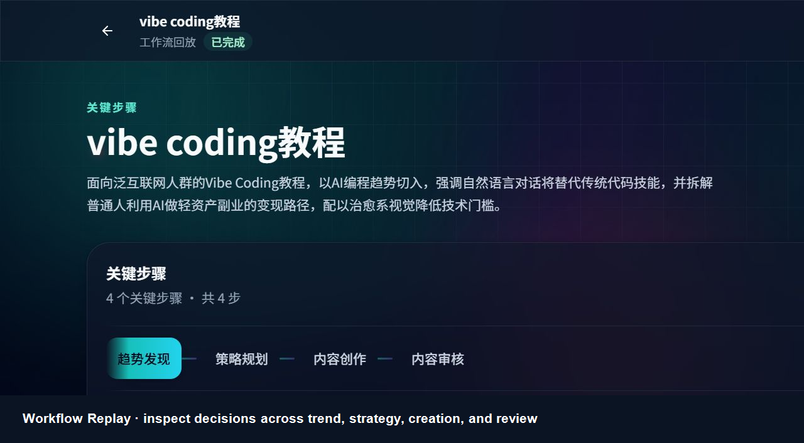
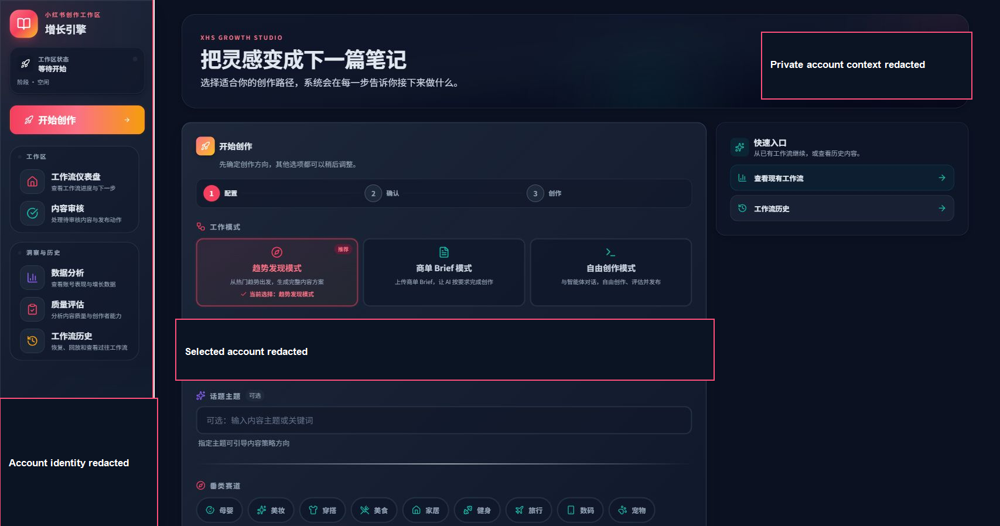
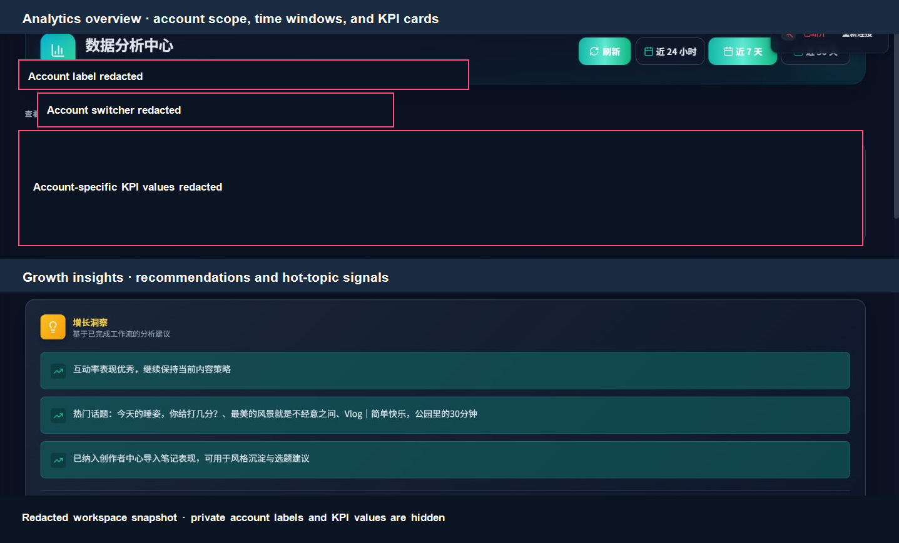

# XHS Growth Agent

AI-assisted content operations for Xiaohongshu (小红书 / RedNote), built as a LangGraph multi-agent workflow with a human approval boundary.

[English](./README.md) | [简体中文](./README.zh-CN.md)

[](https://xhs.jameryw.dev/)
[](./LICENSE)

> From trend discovery to a reviewable, publish-ready note — with the evidence, decisions, and outputs kept visible.

## Why it exists

XHS Growth Agent turns a growth brief into a repeatable content workflow. It combines research, positioning, copywriting, visual direction, quality checks, publishing, analytics, and engagement into one resumable run instead of a collection of disconnected prompts.

The product is designed for creators, operators, and teams who need to:

- turn a trend or brief into a clear content angle;
- produce a complete note package — title, body, hashtags, and visual direction;
- keep a person in control before anything is published;
- compare workflow history and performance across accounts; and
- reuse the same workflow from the web UI, CLI, API, or terminal extension.

## Live product showcase

The public deployment has two read-only surfaces for inspecting the product before signing in:

- [Open the public Showcase](https://xhs.jameryw.dev/) — browse approved sample cases and their final outputs.
- [Open the sample Workflow Replay](https://xhs.jameryw.dev/replay/case_c35a6559d23fd17cd832?from=%2F) — step through the evidence chain from trend discovery to content review.

The `Start creating` entry point is an authenticated workspace. The public pages demonstrate the product and its outputs; creating, running, reviewing, or publishing your own workflow requires login and configured credentials.

### Product tour at a glance

<p align="center">
  
</p>

| Area | Live entry | Access | Demonstrates |
| --- | --- | --- | --- |
| Public Showcase | [`/`](https://xhs.jameryw.dev/) | No login | Browse approved cases and inspect the final output. |
| Workflow Replay | [`/replay/:caseId`](https://xhs.jameryw.dev/replay/case_c35a6559d23fd17cd832?from=%2F) | No login | Follow the evidence chain from trend discovery to review. |
| Start Creating | `/start` | Login required | Choose a path, set the account and goal, then enter the matching workspace. |
| Analytics | `/analytics` | Login required | Switch account scope, filter time windows, and inspect growth insights. |

Start with the overview, then use the detailed panels to inspect each surface. Every image uses a complete feature region with an explicit boundary, so the README stays readable at a glance.

### Showcase landing page

<p align="center">
  
</p>

*Captured from the public deployment on 2026-08-12. This crop keeps the complete Showcase hero panel and removes partial cards or scroll continuation.*

### Workflow Replay

<p align="center">
  
</p>

*The replay keeps key decisions and generated outputs inspectable. This image ends at the complete stage-navigation panel.*

The public sample demonstrates:

1. Trend discovery and audience insight.
2. Strategy planning and topic positioning.
3. Content creation with a title, long-form body, and visual direction.
4. Content review with key takeaways, hashtags, image count, and a color palette.

### Authenticated workspace feature panels

The signed-in workspace adds account-scoped creation and growth operations on top of the public case viewer. These feature panels were captured from the deployed product on 2026-08-12; private account names, KPI values, and post/topic text are deliberately redacted. Each image is composed from complete UI regions rather than a clipped long-page scroll.

<p align="center">
  
</p>

*Start Creating: choose Trend Discovery, Commercial Brief, or Free Creation. Selecting Free Creation reveals the guided goal composer before entering the Agent workspace.*

<p align="center">
  
</p>

*Analytics: switch account scope, select a time window, inspect KPI cards and growth insights, and continue into topic, chart, post-level, and CSV-export views.*

### Free Creation path

Free Creation now starts with a guided hand-off instead of dropping the user into an empty terminal:

1. Choose the target XHS account on Start Creating.
2. Describe a goal, rough idea, or existing draft, or fill the field from an example prompt.
3. Enter the Agent workspace with that goal prefilled in the editable prompt. Nothing is sent until the user confirms.
4. Continue the account-scoped loop through conversation, `/drafts`, `/evaluate`, `/analytics`, revision, and publishing.

The goal and account selection travel together, so free-mode drafts and follow-up insights stay attached to the creator account the user chose.

### Authenticated workspace tour

After sign-in, the workspace is account-scoped and covers creation, review, analytics, and account operations:

| Surface | What you can do |
| --- | --- |
| Start Creating | Choose Trend Discovery, Commercial Brief, or Free Creation; select an account; and, for Free Creation, carry an editable goal into the Agent workspace. |
| Dashboard | Follow a live workflow, inspect phase outputs, recover the next action, and resume an interrupted run. |
| Review | Compare the generated note package, submit approval/rejection/revision feedback, and keep the publish boundary explicit. |
| Analytics | Switch accounts, choose 24-hour/7-day/30-day windows, inspect KPI cards, growth insights, hot topics, charts, post-level tables, and export CSV. |
| Evaluation | Review post-publish performance, RQGM content-review trends, sample confidence, quality dimensions, and evaluated workflows. |
| History | Browse account-scoped workflow history, switch between accounts without changing workspace context, and resume or replay prior runs. |
| Settings | Manage console users, XHS accounts, QR/browser login state, creator-center data binding, global model/Ripple/vector configuration, and public-page experience monitoring. |
| Help Center | Read FAQs, open keyboard shortcuts, and submit product feedback. |

The inventory above reflects the signed-in workspace observed on 2026-08-12. Account names, private metrics, post text, and workflow records vary by deployment and are intentionally not checked into this repository; the public Showcase/Replay images and the redacted workspace panels above are the shareable evidence assets.

### From input to output

With the relevant integrations enabled, a run moves from the following inputs through workspace steps to inspectable outputs:

| Input or signal | Workspace step | Output to inspect |
| --- | --- | --- |
| Free Creation goal | Start Creating → Agent workspace | Editable prompt, selected account, and an explicit send decision |
| Trend or growth brief | Start Creating | Account, topic, vertical, and readiness state |
| Research signals | Trend Scout + Content Strategist | Evidence, audience insight, positioning, and timing |
| Draft direction | Copywriter + Visual Designer | Title, body, hashtags, CTA, and visual plan |
| Human decision | Review | Approval, rejection, or revision feedback before publishing |
| Approved package | Quality Evaluation + Publisher | Quality result, publish request, and optional experiment/scheduling hooks |
| Performance feedback | Analytics + Engagement | KPIs, topic patterns, post-level results, and signals for the next run |

## Product capabilities

| Capability | What it does | Where it appears |
| --- | --- | --- |
| Trend scouting | Finds hot topics, keywords, audience signals, and competitor patterns. | Trend Scout, public Replay |
| Content strategy | Converts a trend or brief into an angle, audience, timing, and growth hypothesis. | Content Strategist, Dashboard |
| Copywriting | Generates titles, body copy, hashtags, CTAs, and revision variants. | Copywriter, Review |
| Visual direction | Recommends cover concepts, layouts, palettes, styles, and image prompts from XHS patterns. | Visual Designer, Review |
| Human review | Pauses at a review gate so a person can approve, reject, or request a revision. | Review workspace |
| Quality evaluation | Adds an AI quality check after human approval and routes weak drafts back for revision. | Evaluation, workflow graph |
| Publishing | Connects approved content to the XHS publisher, with A/B variant and scheduling hooks. | Publisher tools, API |
| Analytics | Reads performance, costs, engagement, and content patterns to inform the next run. | Analytics, Analyst |
| Engagement | Supports comment replies and direct-message workflows through the selected account session. | Engagement tools |
| Account operations | Keeps account context, browser sessions, and history scoped to the selected creator account. | Settings, account controls |

### The end-to-end workflow

```text
Trend / brief
    ↓
Trend Scout → Content Strategist → Copywriter + Visual Designer
                                      ↓
                              Review Gate (human)
                                      ↓
                              Quality Evaluation
                              ↙               ↘
                         Revise              Publish
                                             ↓
                                  Analytics + Engagement
```

Runs are resumable and expose status, intermediate results, review decisions, and performance logs. The review gate is deliberate: the agent can prepare and evaluate content, but the publishing boundary remains visible and controllable.

## Web workspace

The Vue 3 frontend is organized around creation, review, growth, and account operations:

| Surface | Route | Purpose |
| --- | --- | --- |
| Public Showcase | `/` | Browse approved cases and inspect final outputs without login. |
| Public Workflow Replay | `/replay/:caseId` | Replay key decisions and evidence for a public case. |
| Start Creating | `/start` | Choose Trend Discovery, Commercial Brief, or Free Creation; configure account/topic/vertical, or carry a Free Creation goal into the Agent workspace. Requires login. |
| Dashboard | `/dashboard/:threadId?` | Follow live status, progress, phase output, recovery, and the next action. |
| Review | `/review/:threadId?` | Preview, approve, reject, or revise content before publishing. |
| Analytics | `/analytics` | Review account-scoped KPIs, time windows, growth insights, hot topics, charts, post tables, and CSV export. |
| Evaluation | `/evaluation` | Inspect post-publish performance, RQGM review trends, sample confidence, and workflow quality results. |
| History | `/history` | Switch account scope, resume, inspect, and replay previous workflows. |
| Settings | `/settings` | Manage console users, XHS accounts/browser login state, creator-center data, system configuration, and public-page monitoring. |
| Help Center | `/help` | Find FAQs, keyboard shortcuts, onboarding help, and feedback entry points. |
| Free Creation TUI | `/tui?mode=free` | Use a terminal-style creation workspace with draft and help shortcuts. |

The public Showcase and Replay are safe-to-browse entry points. The private workspace, account sessions, provider keys, and publishing actions remain behind authentication and local configuration.

## Architecture

### Runtime

- **Backend:** Python 3.11+, FastAPI, LangGraph, Pydantic, Typer, Uvicorn
- **Frontend:** Vue 3, Vite, Pinia, Vue Router, Tailwind CSS, ECharts, xterm.js
- **Persistence:** SQLite/in-memory checkpoints for development; PostgreSQL and Redis for production deployments
- **Browser automation:** Playwright with per-account browser/CDP session support
- **Optional prediction engine:** Ripple CAS, connected through an HTTP integration

### Agent and tool layers

| Agent | Representative tools | Output |
| --- | --- | --- |
| `trend_scout` | `xhs_trending`, `keyword_monitor`, `competitor_analyzer` | Trend and audience signals |
| `content_strategist` | `topic_scorer`, `timing_optimizer`, `ripple_predict` | Angle, timing, and positioning |
| `copywriter` | `hashtag_researcher`, `title_generator` | Note copy and variants |
| `visual_designer` | `image_prompt_generator`, `layout_recommender` | Cover and visual plan |
| `review_gate` | Human-in-the-loop interrupt | Approval or revision feedback |
| `publisher` | `xhs_publisher`, `ab_test_manager`, `post_scheduler` | Publish request and experiment setup |
| `analyst` | `analytics_reader`, `pattern_detector`, `report_generator` | Performance insights |
| `engagement` | `comment_replier`, `dm_handler` | Account engagement actions |

### Model routing

Task-specific routing lets each stage use the provider best suited to the job. Providers are configured through environment variables and can be changed without rewriting the workflow.

| Task | Default route in the project |
| --- | --- |
| Routing and scouting | DeepSeek |
| Strategy and writing | Claude Sonnet 4 |
| Visual planning and analysis | GPT-4o |
| Publishing | Qwen Plus |
| Engagement | DeepSeek |

## Installation

```bash
git clone https://github.com/JameryW/XhsGrowthAgent.git
cd XhsGrowthAgent

pip install -e ".[dev,browser]"
playwright install
```

Copy the example environment file and add at least one LLM provider key:

```bash
cp .env.example .env
```

### Provider configuration

| Variable | Purpose | Required |
| --- | --- | --- |
| `ANTHROPIC_API_KEY` | Anthropic models | At least one provider key |
| `OPENAI_API_KEY` | OpenAI models | At least one provider key |
| `DEEPSEEK_API_KEY` | DeepSeek routing and scouting | Optional if another route is configured |
| `DASHSCOPE_API_KEY` | Alibaba/Qwen publishing route | Optional if another route is configured |
| `RIPPLE_BASE_URL` | Ripple CAS service URL | Optional |
| `RIPPLE_API_TOKEN` | Ripple CAS token | Optional |
| `POSTGRES_URI` | Production checkpoint/database connection | Production |
| `REDIS_URI` | Production cache and coordination | Production |

See [docs/configuration.md](./docs/configuration.md) for the full environment reference and [docs/security.md](./docs/security.md) for secret and account-session guidance.

## Quick start

### Run the workflow from the CLI

```bash
# Validate the workflow without calling external APIs
xhs-growth run --dry-run

# Start with a specific account and phase
xhs-growth run --account-id my_account --phase scouting

# Inspect a workflow and resume an interrupted run
xhs-growth status <thread_id>
xhs-growth resume <thread_id>
```

### Start the web/API server

```bash
xhs-growth serve --port 8000
```

For frontend development:

```bash
cd frontend
npm install
npm run dev

# Production build and checks
npm run build
npm run type-check
npm run test:run
npm run i18n:check
```

### Python API

```python
from backend.graph.builder import compile_graph_dev

graph = await compile_graph_dev()
config = {"configurable": {"thread_id": "demo-thread"}}

result = await graph.ainvoke(
    {"phase": "scouting", "account_id": "my_account"},
    config,
)
```

For HTTP endpoints, request and response examples, review submission, analytics, and health checks, see [docs/api-reference.md](./docs/api-reference.md).

## Ripple CAS integration

The project integrates with the forked [JameryW/Ripple](https://github.com/JameryW/Ripple) service for content-prediction signals. The fork adds provider abstractions, top-level `provider_insights`, per-phase timeouts, and `job.timed_out` events used by this project.

Supported operations include health and ping checks, simulation submission/status, compact logs, output JSON, report generation, event streams, and cancellation.

```bash
git clone https://github.com/JameryW/Ripple.git
cd Ripple
podman build -t ripple-service:local -f deploy/docker/Dockerfile .
podman run -d --name ripple-service \
  -p 127.0.0.1:8080:8080 \
  -e RIPPLE_API_TOKEN=your_token \
  localhost/ripple-service:local

RIPPLE_BASE_URL=http://127.0.0.1:8080
RIPPLE_API_TOKEN=your_token
RIPPLE_ENABLED=true
```

## oh-my-pi extension

The optional [oh-my-pi](https://github.com/can1357/oh-my-pi) extension exposes the workflow from a terminal agent:

```bash
cd backend/omp/extensions/xhsagent-ext
npm install
export XHS_AGENT_API_BASE=http://localhost:8000
```

Use `/xhs [topic]` to start a workflow and `/xhs-review` to review pending content. The extension also provides start, status, pause, resume, cancel, approve, and reject tools.

## Visual recommendation engine

The visual layer uses data-driven recommendations. It extracts patterns from XHS posts, stores scene-level data with expiry, and recommends layouts and styles by content type, compatibility, popularity, palette, and trend score.

Supported scene families include food, travel, fashion, beauty, lifestyle, fitness, and home decor. The recommendation models live under `backend/tools/visual/` and are consumed by the visual designer workflow.

## Testing and development

```bash
# Backend
pytest
ruff check .
ruff format --check .
mypy backend

# Frontend
cd frontend
npm run test:run
npm run type-check
npm run i18n:check
npm run build
```

Further guides:

- [Frontend UX and interaction conventions](./docs/frontend-ux-optimization.md)
- [Deployment](./docs/deployment.md)
- [Configuration](./docs/configuration.md)
- [API reference](./docs/api-reference.md)
- [Security](./docs/security.md)
- [Contributing](./CONTRIBUTING.md)

## License

MIT License — see [LICENSE](./LICENSE).
